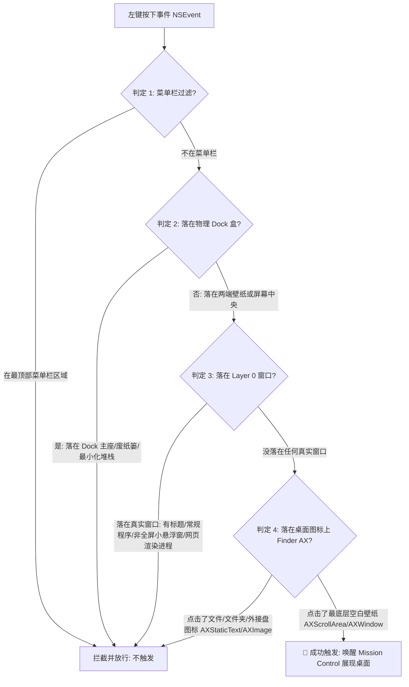

# BackDesk 🖥️

> **专为 macOS 12/13/14+ 系统打造的高品质桌面快速摊开与展示工具。**

BackDesk 是一款极具现代感且完全后台运行（无 Dock 图标）的 macOS 原生常驻辅助工具。它允许您通过**简单点击桌面空白壁纸处**，利用 macOS 极其丝滑的原生 Mission Control 动画，瞬间摊开所有窗口露出桌面；再次点击桌面即可立刻恢复窗口原状。

---

## 🌟 核心特色与技术突破

### 1. ⚡ 零点击·权限自动激活
*   **痛点**：传统辅助功能应用在首次申请权限被授予后，需要用户重启应用或双击开关才能生效。
*   **突破**：内置轻量级每秒权限轮询定时器，且将全局鼠标监听器注册全面改为**在主线程异步执行（`DispatchQueue.main.async`）**，彻底避开了 macOS 主线程 Runloop 开启前的注册死锁（Race Condition）。首次授权后，**100% 启动即用，零点击激活**！

### 2. 🎛️ 物理级 Dock 栏复合包围盒过滤
*   **痛点**：Click 在 Dock 栏图标、右侧废纸篓、最小化堆栈时容易产生误触闪烁；且传统 visibleFrame 会死板地将底部整条横向带状区域过滤，导致 Dock 栏两侧大片空白壁纸处无法点击生效。
*   **突破**：动态抓取屏幕上所有属于 `Dock` 进程的窗口（主面板、图标、废纸篓与堆栈等），通过差集算法自动合并出精细的 **物理 Dock 复合包围盒**，并外延 15px 缓冲防漏区。**完美支持点击 Dock 栏左侧、右侧等任何空白壁纸位置瞬间触达，同时 100% 精准拦截废纸篓、最右侧图标等点击误触**！

### 3. 🖥️ 多显示器与辅助渲染子进程过滤
*   **痛点**：多屏使用或使用 Chrome、微信网页版、Electron 架构应用时，点击其辅助渲染进程（如 `Google Chrome Helper`）或非活动焦点窗口时，容易被误判为点击了壁纸。
*   **突破**：开发了多维度高保真真实交互窗口分类算法 `isRealInteractiveWindow`。自动检索窗口标题非空状态、对比所有显示器的全屏物理尺寸（允许2像素分界微调误差）。**完美兼容多屏幕跨屏显示以及任何网页/视频 GPU 渲染子进程，杜绝一切偶发性误触**！

### 4. 📂 桌面图标深度探测与无缝拦截
*   **痛点**：点击桌面的文件或文件夹时，软件常发生误触发。
*   **突破**：完美结合 Accessibility API（辅助功能）的 Role 与 Title 双向智能检测。只要点击 Finder 进程的元素，且其不是最底层的 `AXScrollArea` 壁纸背景，且标题不为空、也不为 `"Desktop"` / `"桌面"` / `"Finder"`，则一律判定为点击了桌面文件图标并进行拦截，**唯有纯净壁纸放行**！

### 5. 🎨 符合 Apple 官方设计美学的图标
*   **突破**：使用 CoreGraphics 自动处理原直角满幅 `AppIcon.png`，完美收缩至符合官方标准的 `824x824` 黄金画布中，自动裁剪为 `185px` 标准圆角（Squircle），并在其底部自然生成多层立体晕染阴影与 `1px` 半透明高光白描边，质感高级生动。

### 6. 💿 企业级 DMG 原生磁盘映像分发
*   **突破**：包名统一固定为干净的 `BackDesk.app`。升级了 [build.sh](build.sh) 编译脚本，使用系统自带的 `hdiutil` 命令行工具进行免依赖、一键原生打包，输出精致的 `.dmg` 安装包，内部自带指向系统应用程序目录的 **`Applications 快捷方式`**，支持丝滑的拖拽安装。

### 7. 🔎 轻量更新提示与用户反馈
*   **更新提示**：通过 GitHub Releases 元数据检查新版本，只提示用户打开下载页，不自动下载、不静默安装，也不需要维护自建服务器。
*   **反馈入口**：菜单栏内置「反馈问题」「复制诊断信息」「查看日志文件」入口，方便用户把环境信息带到 GitHub Issues，同时避免自动上传日志。

---

## 🗺️ 系统运行与判定架构



---

## 📂 项目结构

*   `main.swift`：核心逻辑实现，包含应用生命周期、权限自动轮询、高精度屏幕区域差集计算、AX 桌面图标透传过滤等。
*   `build.sh`：自动化多架构编译与 DMG 磁盘映像打包脚本。一键完成 Intel (x86_64) 和 Apple Silicon (arm64) 独立包及 Universal 通用包的编译、签名、Zip 压缩与 DMG 原生制作。
*   `Scripts/dev.sh`：本机开发安装脚本，生成带调试菜单的全量功能版本并安装到 `/Applications/BackDesk.app`。
*   `Scripts/package-app.sh`：生成本机 `.app`，支持 `--debug` 与 `--production` 两种构建配置。
*   `Scripts/package-debug-apple-silicon.sh` / `Scripts/package-release-apple-silicon.sh`：生成 arm64 调试版与发布版 `.app`。
*   `Scripts/package-debug-intel.sh` / `Scripts/package-release-intel.sh`：生成 x86_64 调试版与发布版 `.app`。
*   `diagnostics.swift`：可视化的层级点击诊断工具，方便在终端实时捕获鼠标坐标下的所有窗口层级深度。
*   `Info.plist`：应用的包基本元数据，包含当前发布版本号。
*   `PRIVACY.md` / `SECURITY.md`：开源发布所需的隐私与安全说明。
*   `.github/ISSUE_TEMPLATE/`：GitHub Issue 模板，覆盖 Bug、功能建议和兼容性反馈。
*   `.gitignore`：智能过滤，排除所有编译垃圾（build/）、临时包、dmg/zip 产物以及系统隐藏文件（.DS_Store）。

---

## 🛠️ 编译、分发与运行

### 1. 本机调试安装
开发和排查点击问题时，建议安装带调试菜单的本机版本：

```bash
./Scripts/dev.sh
```

这个脚本会重新编译 BackDesk，安装到 `/Applications/BackDesk.app`，并启动应用。调试版会在 **应用兼容模式** 菜单里显示「记录点击调试日志」和「紧急暂停监听 5 分钟」。

只想检查调试版能否编译，不安装到系统应用目录：

```bash
./Scripts/dev.sh --build-only
```

如果 macOS 因重新编译导致辅助功能权限失效，可以运行：

```bash
./Scripts/dev.sh --reset-accessibility
```

然后在系统设置里关闭并重新打开 BackDesk 的辅助功能权限。

### 2. 分架构应用包
如果需要像 LocalFlow 一样生成指定架构和构建类型的 `.app`，可以使用：

```bash
./Scripts/package-debug-apple-silicon.sh
./Scripts/package-release-apple-silicon.sh
./Scripts/package-debug-intel.sh
./Scripts/package-release-intel.sh
```

产物分别为：

```text
BackDesk_debug_arm64.app
BackDesk_release_arm64.app
BackDesk_debug_x86_64.app
BackDesk_release_x86_64.app
```

调试版会启用开发菜单；发布版不会启用开发菜单。

也可以直接使用核心脚本：

```bash
./Scripts/package-app.sh --debug --arm64 --output-name BackDesk_debug_arm64.app
./Scripts/package-app.sh --production --x86_64 --output-name BackDesk_release_x86_64.app
```

### 3. 公开版本打包
在终端中进入项目文件夹，运行打包脚本：
```bash
./build.sh
```
**编译产物**：
脚本执行成功后，您将在项目根目录下获得针对不同芯片架构编译的 `.zip` 安装包。若当前 macOS 环境允许创建磁盘映像，也会额外生成 `.dmg` 镜像。推荐优先使用通用版 `BackDesk_v0.2.8_universal.zip`。

如需单独生成可拖拽安装的 DMG：

```bash
./Scripts/package-dmg.sh
```

DMG 内包含 `BackDesk.app` 和 `Applications` 快捷方式，打开后可直接将 App 拖入应用程序目录。

> 公开发布包不要使用 `./Scripts/dev.sh` 生成。公开包统一使用 `./build.sh` 和 `./Scripts/package-dmg.sh`，它们不会启用开发调试菜单。

### 4. 安装与运行
1. 解压 `BackDesk_v0.2.8_universal.zip`；
2. 将 `BackDesk.app` 拖入 `Applications`（应用程序）文件夹中；
3. 打开 Launchpad 或应用程序文件夹，双击运行 **`BackDesk`**。
4. 顶部状态栏会常驻 🖥️ 图标，点击可勾选「开机自动启动」或查看辅助功能授权状态。

### 5. 更新与反馈
*   菜单栏选择 **帮助与反馈 -> 检查更新...** 可读取 GitHub Releases 并提示是否存在新版本。
*   菜单栏选择 **帮助与反馈 -> 反馈问题...** 可打开预填诊断信息的 GitHub Issue 页面。
*   菜单栏选择 **帮助与反馈 -> 复制诊断信息** 可复制版本、系统、权限和日志路径等排查信息。
*   菜单栏选择 **帮助与反馈 -> 查看日志文件** 可在 Finder 中定位本机日志。

> [!IMPORTANT]
> **📢 开启 Accessibility 权限的 macOS 平台安全提醒**：
> macOS 拥有一套严格的安全签名和沙箱机制。每当应用**重新编译**（即二进制哈希值改变）时，即使系统辅助功能列表中 `BackDesk` 的开关仍然显示为开启状态，系统在底层也会**默默使其失效**。
> **解决办法**：每当您本地调试并重新编译 BackDesk 后，请前往 **系统设置 -> 隐私与安全性 -> 辅助功能**，将 `BackDesk` 的开关**关闭，然后重新开启一次**（即重置系统安全缓存），即可完美恢复所有拦截和触发功能！
