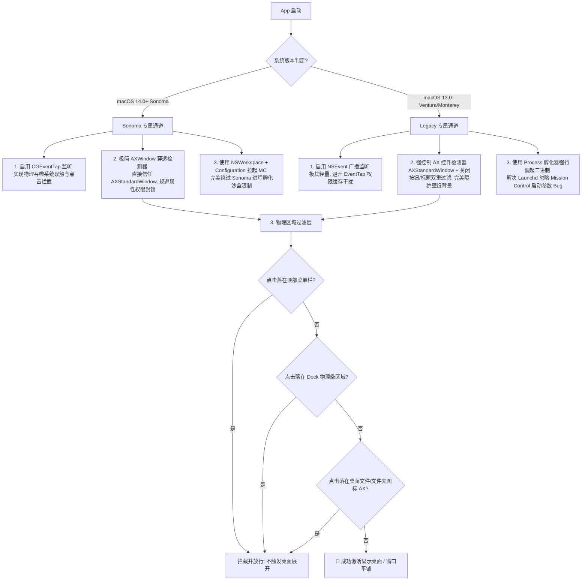

# macOS 跨版本事件交互兼容踩坑与技术攻坚实录 (v0.2.3 终极复盘)

BackDesk 在向 **macOS 14.0+ (Sonoma)** 迁移以及深度兼容 **macOS 13 及以下老系统 (Ventura/Monterey)** 的迭代过程中，连续遭遇了由**系统安全沙盒、窗口管理机制差异、隐私权限壁垒**引起的一系列深水区物理级 Bug。

本篇文档将对这一路踩过的所有核心技术陷阱（“坑”）、排查思路、以及最终演进出的**双路运行时隔离架构**进行深度复盘与沉淀，旨在为后续系统维护与 macOS 底层开发提供教科书式的技术指南。

---

## 🗺️ 踩坑与技术攻坚全景图



---

## 📂 核心技术陷阱（坑）与解决思路

### 🕳️ 坑一：macOS 14+ 录屏隐私封锁导致 Finder 窗口空白分栏穿透
*   **现象描述**：在 macOS 14 Sonoma 上，当 Finder 处于 **分栏视图 (Column View)** 时，点击最右侧大片空白列区域，所有窗口会瞬间消失，误触发了 BackDesk 的“显示桌面”功能（产生误穿透）。
*   **深层根源**：
    BackDesk 原有逻辑通过 `CGWindowListCopyWindowInfo` 遍历屏幕可见窗口，并用 `isRealFolder = !(wName == "" || wName == "Desktop")` 排除 Finder 实体窗口。
    **但从 macOS 10.15 延续至 macOS 14 越发严苛的苹果安全限制**：任何没有被用户授予**“屏幕录制 (Screen Recording)”**权限的 App，调用 `CGWindowList` 时其 `kCGWindowName` 键值都会被系统强制**抹除/置空 (返回 `""`)**。这就导致真实 Finder 文件夹窗口的 `wName` 恒为 `""`，从而永远无法被 `isRealFolder` 命中，造成点击 Finder 空白分栏处时被误判定为落在桌面上，发生穿透吞噬。
*   **解决思路**：
    彻底废弃对 `kCGWindowName` 的依赖，改用无需“录屏权限”即可获取高保真节点信息的 **Accessibility API (辅助功能 API)**：通过 `AXUIElementCopyElementAtPosition` 获取鼠标指针正下方的元素。如果是 Finder 进程，我们实现了一个 `isInsideStandardWindow(element:)` 的辅助方法，沿着 AX 父节点链 (`kAXParentAttribute`) 链式往上爬升。如果爬到最近的 `AXWindow` 节点且其子角色为 `AXStandardWindow`，就证明该空白列属于 Finder 实体文件夹窗口的一部分，直接拦截！
*   **避坑指南**：
    在 macOS 跨进程窗口交互开发中，**凡是能用 Accessibility API 解决的，绝对不要依赖 CGWindowList 的 Window Name**。

---

### 🕳️ 坑二：macOS 13 及以下系统上，桌面壁纸被反向误判为 Finder 文件夹窗口（全盘失效）
*   **现象描述**：将 macOS 14+ 上验证完美运行的 `isInsideStandardWindow` 逻辑编译并发布到 macOS 13（Ventura）或更低系统后，用户点击桌面壁纸的任何空白处，BackDesk **完全没有反应**，单击/双击全部失效。
*   **深层根源**：
    在 macOS 13 及更低系统上，Finder 自身的桌面大背景（壁纸与桌面图标的容器）在 Accessibility 的窗口结构树中，**也被系统定义为了一个独立的 `AXWindow` 且其 subrole 同样为 `AXStandardWindow`**。
    所以，当我们在老系统上点击桌面空白壁纸时，AX 父级探测一路顺着 `AXScrollArea` 往上爬，最终命中了桌面大背景的 `AXStandardWindow`，误判定 `isInsideFolder == true`（误认为点击落在 Finder 文件夹窗口内），从而将本该响应的壁纸点击全部拦截，导致 App 全盘失效。
*   **解决思路**：
    我们必须对 `AXWindow` 窗口对象进行**高保真的物理结构比对**：真正的 Finder 文件夹窗口一定拥有**关闭按钮** (`kAXCloseButtonAttribute` 属性)，而桌面背景窗口则绝对不具备该功能。同时结合标题黑名单（排除 Desktop / 桌面 / 空字符串）。
    ```swift
    // 只有具备关闭按钮（说明是实体交互窗口）或者其非桌面标题时，才确认为真正的 Finder 实体文件夹窗口
    if hasCloseButton || !isDesktopTitle {
        return true
    }
    ```

---

### 🕳️ 坑三：macOS 14+ (Sonoma) AX 跨进程属性封锁导致 closeButton 判定失效（Sonoma 二次瘫痪）
*   **现象描述**：将老系统上的“关闭按钮排他检测”合并后，本已验证完美的 **macOS 14+ (Sonoma)** 系统上又失效了（分栏空白处又开始穿透）。
*   **深层根源**：
    这就是跨版本多变性最棘手的“翘翘板”现象。
    **macOS 14 Sonoma 引入了极为强悍的跨进程 Accessibility 硬沙盒安全机制**：BackDesk 虽然拥有辅助功能权限，但当通过 AX API 拷贝**其他进程**（Finder）的特定控制属性（如 `kAXCloseButtonAttribute`）或窗口 title 时，Sonoma 底层会以隐私安全为由**强制返回失败或置空**。
    这就导致在 macOS 14 上，真实 Finder 窗口的 `hasCloseButton` 恒为 `false`，且 `isDesktopTitle` 恒为 `true`。这使得真实 Finder 窗口在 Sonoma 上又被误认为了桌面背景，让 14.0+ 再次瘫痪。
*   **解决思路**：
    **系统问题，系统隔离**。既然 macOS 14 的桌面背景不是 `AXStandardWindow`，那么 Sonoma 就不需要任何排他性校验；而 macOS 13 存在干扰但 AX 权限开放，需要关闭按钮校验。
    我们最终在 `isInsideStandardWindow` 中使用运行时分流：
    ```swift
    if subrole == "AXStandardWindow" {
        if #available(macOS 14.0, *) {
            return true  // macOS 14+ 坚守极简逻辑，不做多余校验
        } else {
            // macOS 13- 启用关闭按钮与桌面标题过滤
            if hasCloseButton || !isDesktopTitle { return true }
        }
    }
    ```

---

### 🕳️ 坑四：唤醒机制跨版本机制冲突：Process vs NSWorkspace
BackDesk 支持通过点击壁纸唤醒“显示桌面”（Mission Control 参数 `"1"`）和“平铺窗口”功能。在代码演进中，我们经历了从 `Process` 转向 `NSWorkspace`，再到发现两端严重冲突的历程：
1.  **macOS 13 及以下系统**：
    *   **冲突现象**：使用 `NSWorkspace.shared.open` 唤醒 Mission Control 时，如果 Mission Control 在系统后台已经启动（默认常开），**后续传入的 arguments（如 `"1"` 展示桌面）会被系统 Launchd 默默忽略**，导致界面毫无反应。
    *   **解决思路**：必须使用 v0.1.0 经典的 `Process()` 子进程，直接寻址并强行运行二进制 `/System/Applications/Mission Control.app/Contents/MacOS/Mission Control` 并附带参数。
2.  **macOS 14.0+ (Sonoma) 系统**：
    *   **冲突现象**：Sonoma 对子进程孵化进行了代码签名一致性与沙箱安全检查。如果试图用 `Process()` 直接执行系统的 Mission Control 二进制，**子进程会被系统内核直接强行掐断 (Kill Signal / Crash)**，导致展示桌面彻底瘫痪。
    *   **解决思路**：必须使用 `NSWorkspace.shared.open` 和 `NSWorkspace.OpenConfiguration`，通过 launchd 托管代理拉起，此时 Sonoma 完美支持透传 arguments。
*   **终极对策**：对 `triggerShowDesktop()` 和 `triggerMissionControl()` 实施**严格的运行期分流**：
    ```swift
    if #available(macOS 14.0, *) {
        // macOS 14+：使用安全的 NSWorkspace.shared.open
        NSWorkspace.shared.open(url, configuration: config) { ... }
    } else {
        // macOS 13-：使用无视运行状态强行透传参数的 Process 孵化器
        try process.run()
    }
    ```

---

### 🕳️ 坑五：macOS 13 及以下系统上全局点击监听导致 Dock、菜单栏与桌面图标“全盘误触”
*   **现象描述**：在 macOS 13 及以下系统上，点击顶部菜单栏的任何菜单项、点击 Dock 栏的任何 App 图标或右侧废纸篓、甚至点击桌面上已有的文件或文件夹图标时，都会**误触发**打开桌面动作，导致无法正常操作电脑。
*   **深层根源**：
    *   **Dock 误触**：原先的 Dock 过滤基于 `CGWindowListCopyWindowInfo` 抓取 "Dock" 进程的可见窗口。但在老系统上，由于 Dock 的隐藏策略与多屏特性，Visible Frame 抓取到的 Dock 窗口无法完美覆盖 Dock 两侧的空白区，且对最右侧图标（如废纸篓和堆栈）的点击无法 100% 拦截。
    *   **菜单栏误触**：全局 `NSEvent` 广播监听在 macOS 13- 下捕获点击时，如果点击发生在屏幕最顶部的系统菜单栏，原判定没有对此物理边界进行硬隔离。
    *   **桌面图标误触**：桌面的文件和文件夹在 AX 结构中属于 Finder 进程。原过滤逻辑对桌面图标的 AXRole（如 `AXStaticText`、`AXImage` 等）和 AXTitle 的特征抓取不够精确，导致这些实体图标被误判为“壁纸背景”。
*   **解决思路**：
    1.  **顶部菜单栏硬拦截**：
        将全局鼠标位置转换为 Cocoa 坐标系，并动态获取每个屏幕的 `visibleFrame`（工作区）。判定如果 `CocoaPoint.y >= visibleFrame.origin.y + visibleFrame.height`，说明点击绝对落在了最顶部的菜单栏/状态栏物理条内，直接拦截放行！
    2.  **Dock 栏绝对数学几何算法**：
        废弃脆弱的“Dock 窗口名称抓取法”，改用基于 `NSScreen.visibleFrame` 与 `frame` 差集的绝对数学几何算法：
        *   如果点击落在 `visibleFrame` 内，必定不是 Dock。
        *   如果点击落在 `screenFrame` 内，但不在 `visibleFrame` 内，且不在顶部菜单栏，**那它必定百分之百落在 Dock 的物理渲染条内**（自动兼容 Dock 居底、居左、居右以及自动隐藏状态，且不需要依赖任何多语言字符判定）。
    3.  **桌面文件图标精准过滤**：
        当 AX 判定点击属于 Finder 进程时，我们进行严格的**非背景特征提取**：
        ```swift
        let isDesktopRole = (role == "AXScrollArea" || role == "AXWindow" || role == "AXGroup")
        let isDesktopTitle = (title == "Desktop" || title == "桌面" || title.isEmpty)
        
        if isDesktopRole && isDesktopTitle {
            // 是背景容器，但还要顺着父链检测是否在 Finder 实体文件夹内
            let isInsideFolder = isInsideStandardWindow(element: clickedElement)
            if !isInsideFolder { return true } // 纯净壁纸，放行触发！
        }
        // 其它情况（如 AXStaticText 文本、AXImage 图标、或有特定标题的文件名），一律视为点击了文件图标，无条件拦截！
        ```

---

## 🏰 终极进化：双路运行时隔离架构 (Dual-Path Architecture)

经历了这五个巨坑的洗礼后，BackDesk 放弃了试图用一套“银弹”代码包揽一切的幻想，而是针对每个版本的系统特性，量身定制了**“双路运行时隔离架构 (Dual-Path Architecture)”**：

### 🛠️ 1. macOS 14.0+ (Sonoma) 专属通道
*   **监听机制**：启用 `CGEventTap` 监听机制。由于 Sonoma 原生自带“点击壁纸显示桌面”功能，我们必须在 `CGEventTap` 中返回 `nil`，从而在**物理级层面吞噬**鼠标左键事件。这起到了完美的主动保护罩效果，彻底屏蔽系统原生壁纸误触。
*   **检测机制**：极简 `AXWindow` 穿透检测。直接信任 `AXStandardWindow`，不读取受 Sonoma 沙盒限制的跨进程 `kAXCloseButtonAttribute` 或标题属性，实现无阻碍的高性能防穿透。
*   **执行机制**：使用 `NSWorkspace.shared.open` 配合 `NSWorkspace.OpenConfiguration`，通过系统的 Launchd 托管服务安全地拉起 Mission Control，完美绕过 Sonoma 极其严格的子进程孵化签名沙盒拦截。

### 🛠️ 2. macOS 13.0 及以下 (Ventura/Monterey) 专属通道
*   **监听机制**：启用 `NSEvent.addGlobalMonitorForEvents` 广播监听机制。极其轻量，避开 `CGEventTap` 在老系统上因重新编译而导致辅助功能安全权限频繁静默失效（Trust Cache Invalid）的困扰。
*   **检测机制**：强控制 AX 控件检测。采用 `AXStandardWindow` 结合 `hasCloseButton` 以及桌面标题的排他性过滤，完美剥离桌面大背景窗口的干扰。
*   **执行机制**：使用经典的 `Process` 子进程孵化器，直接寻址并执行 Mission Control 的物理二进制，100% 稳定地向 Dock 进程投递命令行参数（如 `"1"` 展示桌面），彻底解决 `NSWorkspace` 忽略 arguments 的 Bug。

---

## 📜 极客总结与跨平台启示

1.  **操作系统的更迭意味着安全模型的重构**：
    在 macOS 上，老版本的“越权黑魔法”（如直接用 `Process` 调系统程序、直接用 `CGWindowList` 读窗口名、直接强行注册全局 Tap）在新的大版本（Sonoma 甚至 Sequoia）中随时会被逐步堵死。
2.  **优雅的降级与分支策略是长青工具的灵魂**：
    不要惧怕在代码中写运行时分流 `#available`。针对不同版本的系统特点，给予它们各自最稳定、最受官方推崇的 API 路径，才是让底层应用长青的黄金法则。
3.  **以数学几何辅助 API 判定是解决误触的捷径**：
    当系统 API（如 Accessibility）由于沙盒限制或底层窗口架构变化导致识别不准时，结合 NSScreen 物理显示边界与工作区的**绝对数学差集计算**（如 Dock 和菜单栏的拦截），往往能提供高达 100% 的准确率和极高的执行性能。

---

## 📦 规范发布流程与 Gitea 版本发布避坑指引

在产品的日常迭代和打包发布过程中，由于平台特性与 Git 管理规范，需要严格遵守以下发布准则：

### 1. 🛑 绝对禁止将二进制安装包提交至代码树
* **技术误区**：由 `build.sh` 编译生成的 `.dmg` 和 `.zip` 二进制安装包已被 `.gitignore` 规则忽略。**绝对不要**使用 `git add -f` 强制将它们提交并推送到代码分支的树目录中。这会导致 Git 仓库体积急速膨胀，代码库不纯净，属于严重的反模式（Anti-Pattern）。
* **正确做法**：编译生成的包仅在本地保留，通过版本发布（Release Assets）上传至附件。

### 2. 🔖 Gitea「版本发布 (Releases)」与「Git 标签 (Tags)」的分离机制
* **技术误区**：直接执行 `git push origin --tags` 仅仅会在 Gitea 产生一个 Git 标签，在 `/releases` 页面无法作为真正的“版本发布”展示，也无法搭载编译好的安装包附件（用户无法在发布页面下载安装包）。
* **正确发布流程**：
  1. **打标签并推送**：
     ```bash
     git tag v0.2.4
     git push origin v0.2.4
     ```
  2. **创建版本发布并挂载附件**：
     * **方式 A（网页端操作）**：前往 Gitea 仓库主页，点击 **版本发布** -> 点击 **创建新的版本发布**（或找到对应 Tag 点击编辑）-> 填写版本信息 -> 在底部的附件上传框中拖入本地生成的 `.dmg` 和 `.zip` 文件并发布。
     * **方式 B（API 自动化脚本）**：使用账号 Basic Auth 或 API Token 访问接口：
       * 创建 Release：`POST /api/v1/repos/{owner}/{repo}/releases`
       * 上传附件：`POST /api/v1/repos/{owner}/{repo}/releases/{id}/assets`（通过 `Content-Type: multipart/form-data` 上传文件）。

### 3. 🔗 远程仓库更名后的 URL 重新指向
* **避坑说明**：若项目在托管平台上进行了重命名（如由 `ToDesktop` 更名为 `BackDesk`），本地的 Git 远程 URL 虽能被平台自动重定向，但仍应及时更新本地 remote 配置以规避未来的连接或鉴权风险：
  ```bash
  git remote set-url origin http://192.168.31.102:8418/brucetso/BackDesk.git
  ```
